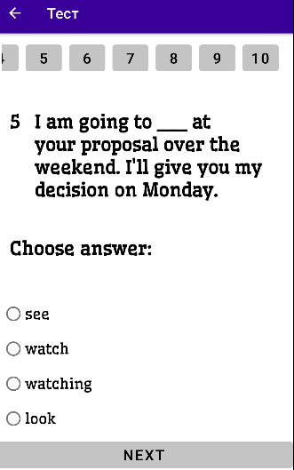
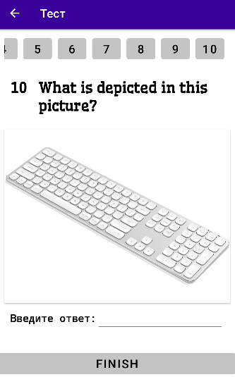
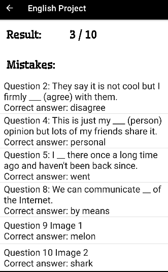

<h1 align="center">Тест для проверки знаний английского языка</h1>

<h1 align="center">Состав команды</h1>

<ul>
    <li>Горбунов Я. А.</li>
    <li>Зотов Е. А.</li>
    <li>Чернов Я. А.</li>
</ul>

<h1 align="center">Описание проекта</h1>

Данное приложение было реализовано, как итоговый проект для предмета Технологии Разработки Программных приложений (ТРПП)
    

Данное приложение представляет из себя тест, в котором заключено 10 вопросов. Вам предлагается ответить на них для того, чтобы определить ваш уровень знания английского языка. По мере прохождения задания становятся сложнее.

<h1 align="center">Снимки экрана приложения</h1>

   
<h1 align="center"> Итоги </h1>

В итоге было спроектировано и реализовано приложение для проверки знаний английского языка

