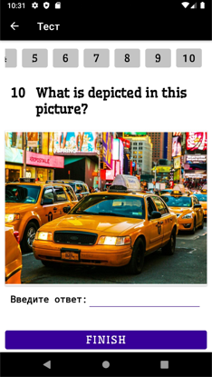

<h1 align="center">Тест для проверки знаний английского языка</h1>

<h1 align="center">Состав команды</h1>

<ul>
    <li>Горбунов Я. А.</li>
    <li>Зотов Е. А.</li>
    <li>Чернов Я. А.</li>
</ul>

<h1 align="center">Описание проекта</h1>

Данное приложение было реализовано, как итоговый проект для предмета Технологии Разработки Программных приложений (ТРПП)

Приложение представляет из себя тест, в котором заключено 10 вопросов. Вам предлагается ответить на них для того, чтобы определить ваш уровень знания английского языка. 

<h1 align="center">Зависимости проекта</h1>

dependencies {

    implementation 'androidx.appcompat:appcompat:1.4.1'
    implementation 'com.google.android.material:material:1.6.0'
    implementation 'androidx.constraintlayout:constraintlayout:2.1.4'
    implementation 'androidx.navigation:navigation-fragment:2.4.2'
    implementation 'androidx.legacy:legacy-support-v4:1.0.0'
    testImplementation 'junit:junit:4.13.2'
    androidTestImplementation 'androidx.test.ext:junit:1.1.3'
    androidTestImplementation 'androidx.test.espresso:espresso-core:3.4.0'
    implementation 'com.google.firebase:firebase-database:20.0.5'
    implementation 'com.github.bumptech.glide:glide:4.13.0'
    annotationProcessor 'com.github.bumptech.glide:compiler:4.13.0'
}

<h1 align="center"> Итоги </h1>

В итоге было спроектировано и реализовано приложение для проверки знаний английского языка

